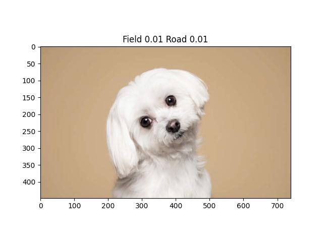

# Field road classification model
This repository contains codes to build a classification model to classify images as fields or roads

<p align="center">
  
  
</p>

## Folder structure
```
├── configs
├── core
    ├── utils.py
    ├── data_preparation.py
    ├── model.py   
    ├── dataset.py 
    ├── dataloader.py 
    ├── transform.py    
    ├── trainer.py
├── data.xlsx   # training data information
├── train.py
├── valid.py
├── inference.py
├── test_images 
├── result
    ├── valid_result.txt    # validation result of trained models
    ├── test_images_result.txt    # prediction of test_images
```

## Environment setup
```
conda env create -f environment.yml
```
or
```
docker compose build
```

## Data exploration
dataset contains 3 folders:
- fields: 45 images
- roads: 108 images
- test images: 10 images

### fields
- annotation contains error: 2 images of road are included. 
- diversity is okay (different types of plants such as flower and vegetables, at different stage of crop, under different weather condition)
- image quality is okay

<p align="center">
  
  
  
</p>

### roads
- annotation is okay
- image quality is okay
- diversity is okay (different types of road, different weather coniditions, different views)
- difficult cases: a few images also contain a small part of field

<p align="center">
  
  
  
</p>

### test images
- contain both road images & field images
- typical cases, okay quality

**data imbalance**: almost twice more road images than field images

## Approach
Objective: build a classifier that can classify a given image as field or road

As real life images might contain both road and field, or neither of them, multilabel classification approach will be more appropriate in real life applications. 

We need to collect more images that contain both field and road, as well as images that contain none of them, and add to the current dataset.

Example of image that contains both field and road

<p align="center">
  
  
  
</p>

Example of image that contains neither field nor road

<p align="center">
  
  
  
</p>

## Data preparation
* collect new images
* clean dataset (correct annotations, remove duplicates or low quality images)
* reorganize dataset into 4 subfolders: fields, roads, fields_roads, others
* get file path and label of each image
* split data into 5 folds for cross-validation
* set sampler weight to handle imbalanced data: 2 for fields, 1 for roads

## Training
### model architecture
EfficientNet B0, cut off at last layer, add a fully connected layer with 2 outputs and sigmoid activation. 

### loss function
BCE loss

### optimizer
* AdamW optimizer
* CosineAnnealingLR

### validation metric
Fbeta score : weighted harmonic mean of precision and recall, reaching its optimal value at 1 and its worst value at 0. The beta parameter represents the ratio of recall importance to precision importance. beta > 1 gives more weight to recall, while beta < 1 favors precision.
Here we assume the equal importance and set beta = 1.

## Inference
* process a single image: print model output
* process by batch for a directory containning several images: 
    * save image name and model ouputs to an excel file
    * show image with model prediction

Example of inference

<p align="center">
  
  
  
  
</p>

## Further improvement
* larger and more diversified dataset
* bigger model with higher capacity
* custommize loss function and validation metric: focal loss might work better
* add more sophisticated data augmentation

## How to use the code
### training
change configuration in `configs/config.yml` and run training with
```
python train.py
```
or
```
docker compose up --build -d
```

### inference
change configuration in `configs/config.yml` and run
```
python inference.py
```
or
```
docker compose up inference
```
